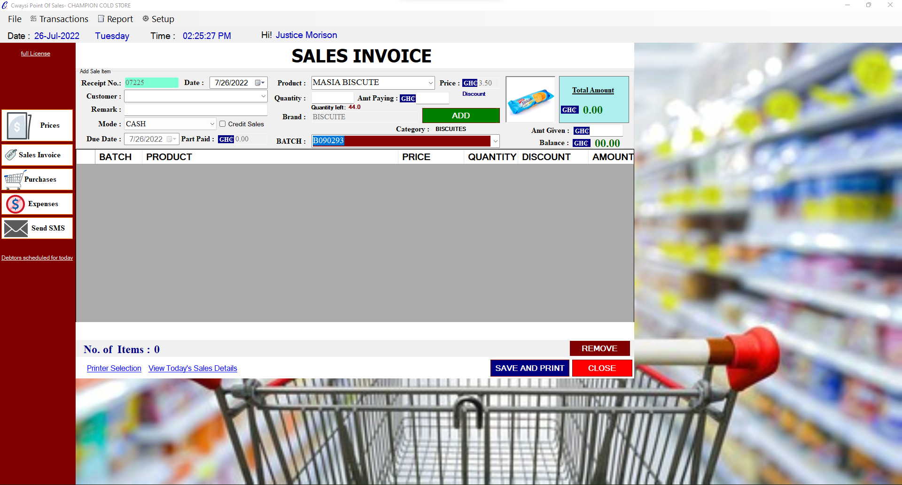
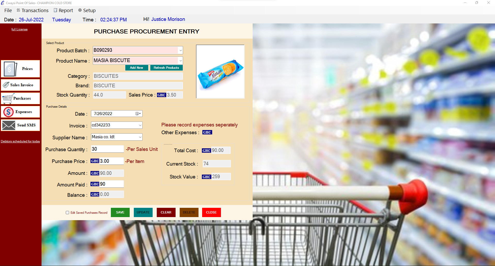
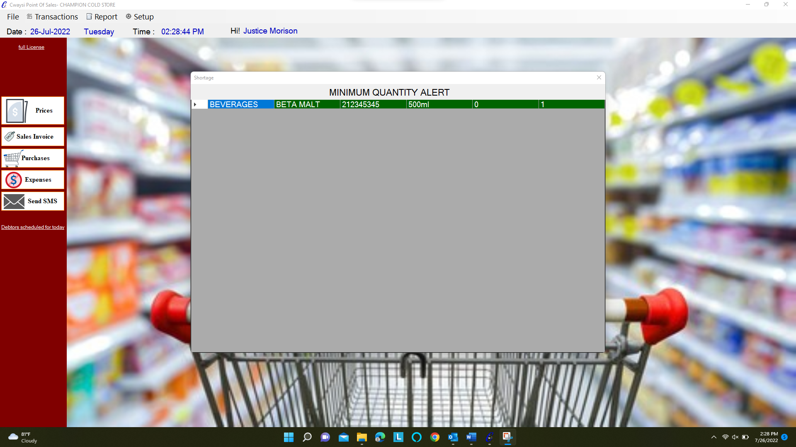
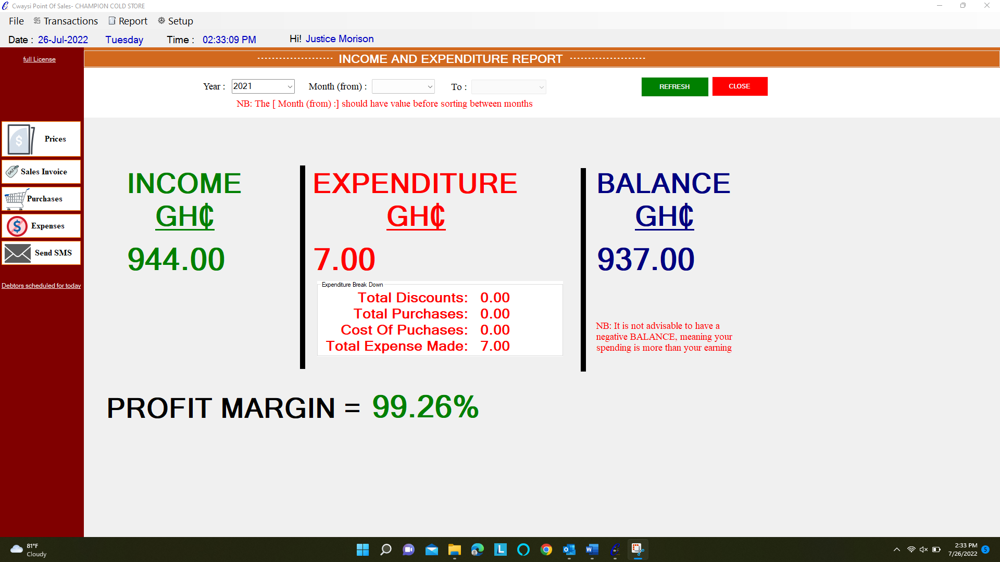

# Point-of-sales
A supermarket or a retail system..

A full supermarket or retail shop point of sales system to manage your slaes, inventory, track purchases, expenses, income and expenditure reports, comprehensive opereational reports, user priviledge and others. The system also seeks to manage receipts and prints out receipts using the receipt printer.

<H2>FEATURES </h2>  
Sales  

purchases  

expenses  
Debtors  
SMS  
Minimum Qty Alert  
 
Debtors due date Alert  
Category and Brand registration  
Product Registration  
Minimum Amount for receipt print out setup  
Sales, Purchases, Expenses, Debtors reports (With filters)  

Inventory  

 
 
view few screenshots from the files

CONTACT: +233553852241 / cwaysimorison@outlook.com
